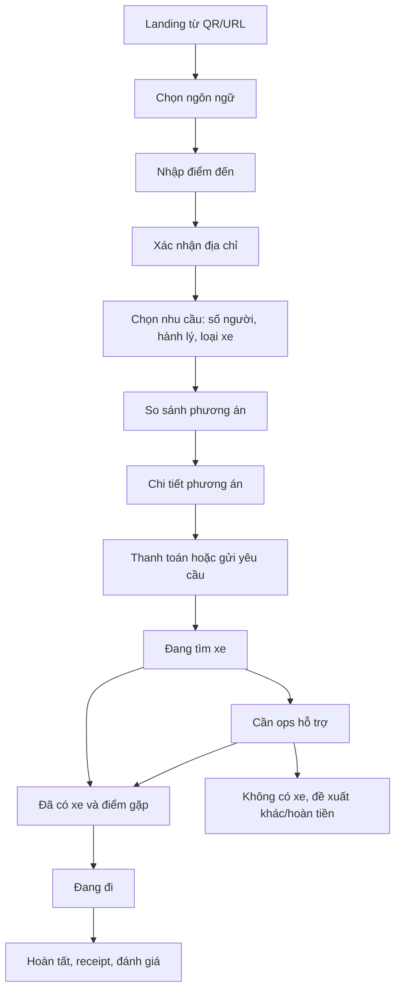

# 04. Blueprint ứng dụng hoàn chỉnh

## Nguyên tắc UX

Ứng dụng phục vụ khách vừa xuống sân bay, có thể mệt, thiếu mạng, không biết tiếng Việt, đang kéo hành lý. Vì vậy UX phải:

- Mobile-first, mở nhanh qua QR, không bắt cài app ở MVP.
- Không nhồi form dài ngay đầu.
- Luôn cho biết “bước tiếp theo là gì”.
- Điểm gặp xe phải rõ hơn bản đồ: zone, tầng, cửa, ảnh, landmark, hướng đi.
- Hiển thị giá/điều kiện/hủy rõ trước khi thanh toán.
- Có hotline/chat ở mọi trạng thái booking.
- Có luồng “tôi bị lạc” cực nhanh.

## Cấu trúc PWA khách

## Màn hình 1: Mở app

Nội dung:

- Logo/brand.
- Ngôn ngữ: English, Tiếng Việt, 中文, 한국어, 日本語.
- CTA chính: `Where are you going?`
- Shortcut:
  - `Hotel in Ho Chi Minh City`
  - `Go to another province`
  - `Find pickup point`
  - `Need help`

Trạng thái:

- Nếu mở từ QR ở pickup zone: app biết pickup zone mặc định.
- Nếu mở từ QR tại khu arrival: app hướng dẫn đến pickup sau khi đặt.
- Nếu offline: hiển thị hotline, bản đồ pickup cache, hướng dẫn cơ bản.

## Màn hình 2: Nhập điểm đến

Control:

- Search box dùng Places Autocomplete.
- Gợi ý theo nhóm:
  - Hotels.
  - Districts.
  - Bus stations.
  - Tourist cities.
  - Recent/popular destinations.
- Nút `I don't know the address`.

Validation:

- Nếu nhiều địa chỉ trùng tên, yêu cầu chọn chi nhánh.
- Nếu destination quá xa, chuyển sang itinerary planner.
- Nếu địa chỉ không đủ rõ, yêu cầu map pin hoặc ops hỗ trợ.

## Màn hình 3: Xác nhận nhu cầu

Fields:

- Số người.
- Hành lý: small/medium/large/oversized.
- Trẻ em/người già/xe lăn.
- Thời điểm đi: now/later/flight arrival.
- Contact: email, WhatsApp, phone, optional.
- Ngôn ngữ hỗ trợ mong muốn.

Không nên hỏi:

- Đăng ký tài khoản bắt buộc.
- Password.
- Thông tin không cần cho booking.

## Màn hình 4: So sánh phương án

Mẫu card phương án:

| Thành phần | Nội dung |
| --- | --- |
| Tên | Economy / Fastest / EV Taxi / Private Transfer / Intercity |
| Giá | Ước tính hoặc fixed |
| Thời gian chờ | 5-15 phút, 20-30 phút |
| Thời gian đi | Theo Routes API/Provider |
| Điều kiện | Hủy, hành lý, thanh toán |
| Trust | Provider, hỗ trợ English, invoice |

Các lựa chọn:

- [x] Hiển thị “Recommended” cho phương án cân bằng nhất.
- [ ] Cho sort theo nhanh nhất/rẻ nhất/cao cấp.
- [ ] Cho filter xe điện, hóa đơn, tiếng Anh.

## Màn hình 5: Thanh toán/giữ chỗ

Phương thức:

- Card quốc tế.
- VietQR/bank transfer.
- Pay at provider.
- Corporate account/voucher.

Thông tin bắt buộc trước khi thu tiền:

- Tổng giá hoặc khoảng giá.
- Chính sách hủy.
- Ai là provider thực hiện chuyến.
- Nếu chỉ là assisted booking, nói rõ đang chờ xác nhận.
- Điều kiện hoàn tiền nếu không có xe.

## Màn hình 6: Đang tìm xe

Hiển thị:

- Progress rõ: `Finding available car`, `Checking partner`, `Confirming driver`.
- Thời gian dự kiến.
- Nút `Cancel`.
- Nút `Talk to support`.

Backend:

- Mỗi bước tương ứng với trạng thái booking/job.
- Nếu quá SLA, đẩy sang ops.

## Màn hình 7: Đã có xe

Thông tin phải có:

- Provider.
- Biển số.
- Tên tài xế.
- Loại xe/màu xe nếu provider cung cấp.
- Pickup zone.
- Ảnh/hướng dẫn đi bộ đến zone.
- Nút `I'm here`.
- Nút `Driver can't find me`.
- Nút `Call/Chat support`.

Nếu provider không chia sẻ thông tin tài xế:

- Hiển thị mã booking và hướng dẫn gặp quầy/nhân viên.

## Màn hình 8: Pickup guidance

Thông tin:

- Tầng/cửa/zone.
- Thời gian đi bộ từ vị trí hiện tại nếu có.
- Ảnh landmark.
- QR/map mini.
- Chỉ dẫn bằng văn bản ngắn, đa ngôn ngữ.

Phương án indoor:

- [x] MVP: static pickup map + ảnh + geofence ngoài trời.
- [ ] Phase 2: Mapbox indoor nếu có dữ liệu terminal.
- [ ] Phase 3: beacon/UWB/Wi-Fi positioning nếu sân bay cho hạ tầng.

## Màn hình 9: Đang đi

Hiển thị:

- Destination.
- ETA.
- Provider/trip id.
- Nút share trip.
- Nút emergency/support.
- Nút request invoice.

Nếu không có realtime tracking:

- Hiển thị trạng thái milestone do provider/ops cập nhật.

## Màn hình 10: Hoàn tất

Hiển thị:

- Receipt.
- Yêu cầu hóa đơn.
- Đánh giá tài xế/provider/app.
- Báo mất đồ.
- Gợi ý dịch vụ liên quan: tour, SIM, airport transfer chiều về.

## Admin dashboard

### View 1: Operations board

Columns:

- New requests.
- Searching provider.
- Waiting payment.
- Waiting driver.
- Pickup pending.
- In trip.
- Issue.
- Completed.

Filters:

- Flight number.
- Pickup zone.
- Provider.
- Language.
- Priority/VIP/group.

Actions:

- Assign provider.
- Mark confirmed.
- Send customer message.
- Trigger refund.
- Escalate to supervisor.
- Open provider portal link.

### View 2: Flight/load monitor

Mục tiêu: nhìn trước đợt dồn tải.

- Danh sách flight hạ cánh trong 2 giờ tới.
- Số booking theo flight.
- Supply estimate theo provider.
- Cảnh báo thiếu xe.
- Ops staffing suggestion.

### View 3: Provider health

- API success rate.
- Average assignment time.
- Cancellation rate.
- No-car rate.
- Manual intervention count.

### View 4: Finance/reconciliation

- Payment captured.
- Provider cost.
- Margin/fee.
- Refund pending.
- Invoice requested.
- Settlement status.

## Kiosk/agent mode

Nếu được đặt tại sân bay:

- Nhân viên nhập booking thay khách.
- In/hiển thị QR booking.
- Quét passport không nên làm nếu chưa có cơ sở pháp lý dữ liệu cá nhân rõ ràng.
- Có mode “group arrival”.

## App tài xế

Không làm ở MVP nếu dùng provider ngoài.

Chỉ cần nếu tự vận hành hoặc white-label fleet:

- Nhận chuyến.
- Điều hướng pickup/dropoff.
- Chat dịch.
- Xác nhận gặp khách.
- Xác nhận hoàn tất.
- Báo sự cố.

## Nội dung đa ngôn ngữ cần chuẩn hóa

- Pickup instructions.
- Payment status.
- Cancellation/refund policy.
- Driver/customer cannot find each other.
- Invoice request.
- Luggage left behind.
- Delay/no car apology + alternatives.

