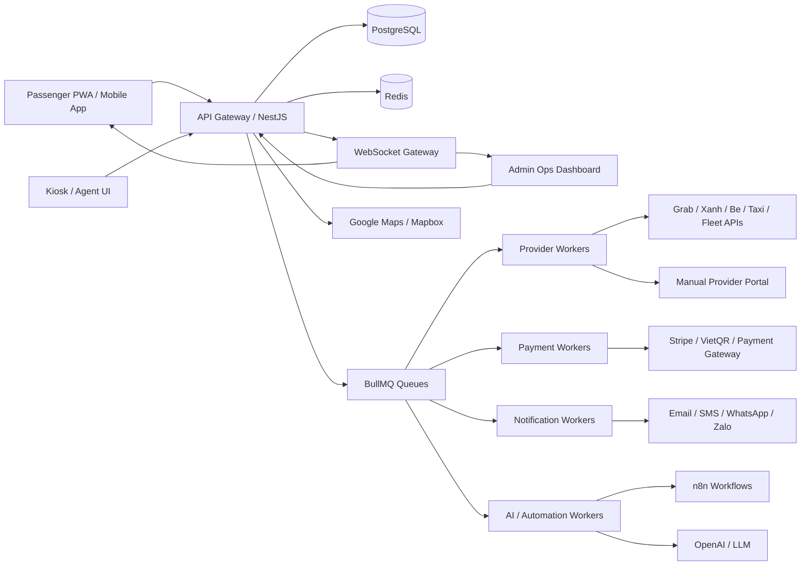
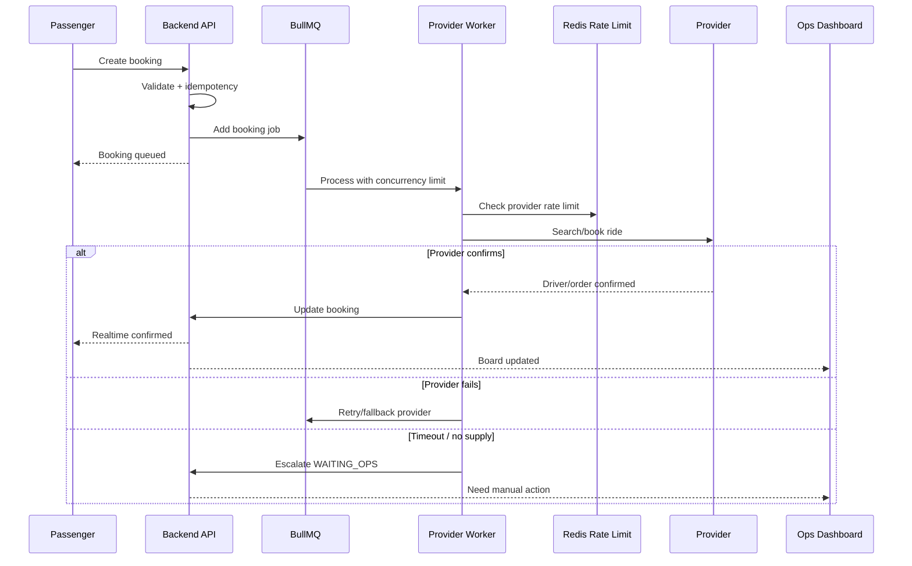
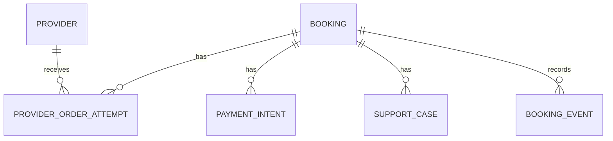
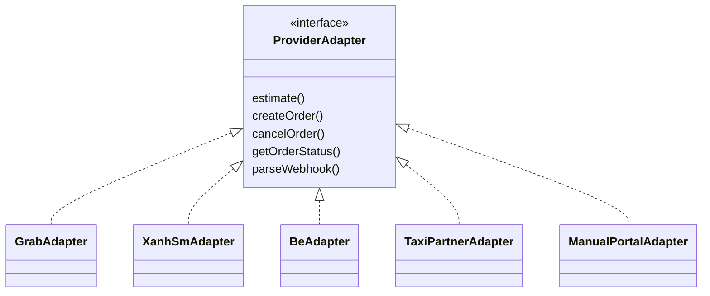

# 06. Kiến trúc hệ thống

## Mục tiêu kiến trúc

- Mở nhanh qua PWA cho khách quốc tế.
- Không phụ thuộc một provider.
- Xử lý được burst sau giờ hạ cánh.
- Cho phép ops can thiệp khi tự động hóa không đủ.
- Tách booking nội bộ khỏi order của provider.
- Quan sát được trạng thái realtime.
- Dễ nâng cấp từ concierge MVP sang hybrid marketplace.

## Sơ đồ tổng thể

## Thành phần chính

### Frontend khách

- Expo React Native Web/PWA.
- Sau MVP có thể build native iOS/Android.
- Offline cache cho trang booking status, hotline, pickup map.
- Deep link cho booking, payment, support.

### Backend API

- NestJS.
- REST cho CRUD/booking/payment.
- WebSocket cho realtime booking updates.
- RBAC cho ops/admin/finance.
- Idempotency middleware.
- Audit log middleware.

### Database

Đề xuất: PostgreSQL.

Lý do:

- Booking/payment/provider order cần transaction rõ.
- Quan hệ dữ liệu phức tạp nhưng vẫn dễ query.
- Hỗ trợ JSONB cho provider payload.
- Dễ làm reporting.

### Redis

Dùng cho:

- BullMQ queue.
- Rate limiting.
- Cache Places/Routes/provider availability.
- Short-lived sessions.
- WebSocket presence nếu cần.

### BullMQ queues

Queues đề xuất:

- `booking-orchestration`: tìm provider, fallback, timeout.
- `payment`: payment webhook, capture, refund.
- `notification`: email/SMS/WhatsApp/Zalo.
- `provider-sync`: poll provider status nếu không có webhook.
- `invoice`: tạo/yêu cầu hóa đơn.
- `ai-assist`: dịch, tóm tắt, itinerary suggestions.
- `ops-escalation`: cảnh báo SLA.

## Xử lý 50 khách cùng lúc

Thiết kế quan trọng:

- Queue không gọi provider vô hạn.
- Mỗi provider có concurrency và rate limit riêng.
- Booking có SLA timer; quá SLA chuyển ops.
- Provider attempts lưu riêng để audit.
- Có thể ưu tiên khách đã trả tiền/VIP/đoàn.

## Booking/provider separation

Không lưu provider order làm booking chính. Một booking có thể thử nhiều provider.

Lợi ích:

- Provider A fail vẫn retry B.
- Có audit đầy đủ.
- Không lệ thuộc schema provider.
- Dễ đối soát cost/margin.

## Realtime update

Các event gửi WebSocket:

- `booking.status_changed`
- `provider.assigned`
- `driver.assigned`
- `pickup.updated`
- `payment.updated`
- `support.case_updated`
- `ops.escalation`

Nếu WebSocket mất kết nối:

- Client fallback polling.
- Notification qua email/SMS/WhatsApp nếu booking quan trọng.

## Provider adapter pattern

## Failure handling

### Provider timeout

- Mark attempt `TIMEOUT`.
- Retry cùng provider nếu policy cho phép.
- Sau N lần fallback provider khác.
- Nếu tất cả fail, chuyển `WAITING_OPS`.

### Payment success, no provider

- Booking `WAITING_OPS`.
- Ops có SLA cố tìm provider.
- Nếu hết SLA, refund hoặc offer alternative.

### Customer no-show

- Provider/ops mark no-show.
- Áp policy hủy.
- Nếu thu phí, ghi rõ lý do và receipt.

### Duplicate booking

- Idempotency key theo session + destination + timestamp window.
- UI disable double submit.
- Backend reject duplicate pending booking nếu cùng khách/cùng destination quá gần.

### Provider webhook duplicate/out-of-order

- Mỗi event có timestamp/provider_event_id.
- Idempotent event handling.
- Không cho state đi lùi nếu không có rule.

## Observability

Metrics:

- Booking created/minute.
- Provider assignment success rate.
- Average time to driver assigned.
- Queue depth.
- SLA breach count.
- Payment failure/refund rate.
- Provider cancellation rate.
- Manual intervention rate.

Logs:

- Correlation id theo booking.
- Provider request/response sanitized.
- Payment webhook sanitized.
- Audit log cho ops actions.

Alerts:

- Queue depth vượt ngưỡng.
- Provider API lỗi liên tục.
- Payment webhook fail.
- Booking chờ provider quá SLA.
- Refund pending quá lâu.

## Security baseline

- HTTPS everywhere.
- JWT/session secure cookies.
- RBAC.
- PII encryption/masking.
- Secrets trong secret manager.
- Webhook signature validation.
- Rate limit public APIs.
- WAF/CDN cho PWA/API.

