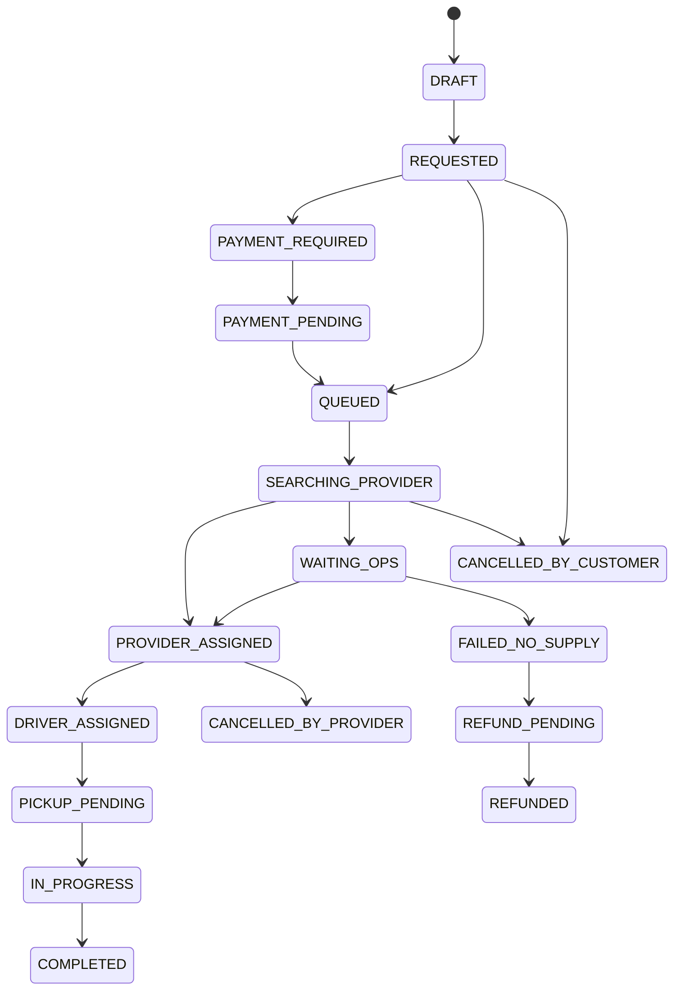

# 09. Data model và API sơ bộ

## Entity chính

### Passenger

Fields:

- `id`
- `display_name`
- `preferred_language`
- `phone`
- `email`
- `whatsapp`
- `country_code`
- `created_at`

Ghi chú:

- Cho phép guest passenger.
- Không bắt đăng ký tài khoản ở MVP.

### Booking

Fields:

- `id`
- `public_code`
- `passenger_id`
- `status`
- `service_type`: `CITY_RIDE`, `INTERCITY_PRIVATE`, `INTERCITY_TICKET`, `MULTI_LEG`, `GROUP`, `ASSISTED`
- `pickup_location_id`
- `dropoff_place_id`
- `dropoff_address`
- `dropoff_lat`
- `dropoff_lng`
- `passenger_count`
- `luggage_count`
- `luggage_note`
- `flight_number`
- `scheduled_pickup_at`
- `requested_language`
- `selected_option_id`
- `total_customer_amount`
- `currency`
- `created_at`
- `updated_at`

### BookingOption

Fields:

- `id`
- `booking_id`
- `option_type`: `ECONOMY`, `FASTEST`, `EV`, `PRIVATE`, `INTERCITY`, `ASSISTED`
- `provider_id`
- `estimated_price_min`
- `estimated_price_max`
- `fixed_price`
- `currency`
- `estimated_wait_minutes`
- `estimated_duration_minutes`
- `cancellation_policy_snapshot`
- `metadata_json`

### Provider

Fields:

- `id`
- `name`
- `type`: `RIDE_HAILING`, `TAXI`, `PRIVATE_CAR`, `BUS_TICKET`, `PAYMENT`, `TOUR`
- `integration_mode`: `API`, `PORTAL_ASSISTED`, `PHONE_ASSISTED`, `DEEPLINK`
- `status`: `ACTIVE`, `PAUSED`, `DEGRADED`
- `capabilities_json`
- `priority`

### ProviderOrderAttempt

Fields:

- `id`
- `booking_id`
- `provider_id`
- `status`
- `provider_order_id`
- `request_payload_json`
- `response_payload_json`
- `driver_name`
- `driver_phone_masked`
- `vehicle_plate`
- `vehicle_type`
- `eta_minutes`
- `provider_cost_amount`
- `currency`
- `failure_reason`
- `created_at`
- `updated_at`

### PaymentIntent

Fields:

- `id`
- `booking_id`
- `provider`
- `method`: `CARD`, `VIETQR`, `PAY_AT_PROVIDER`, `CORPORATE`
- `status`
- `amount`
- `currency`
- `gateway_payment_id`
- `qr_url`
- `expires_at`
- `created_at`
- `updated_at`

### Itinerary

Fields:

- `id`
- `booking_id`
- `status`
- `summary`
- `total_duration_minutes`
- `total_amount`
- `currency`

### ItineraryLeg

Fields:

- `id`
- `itinerary_id`
- `leg_index`
- `leg_type`: `CAR`, `BUS`, `TRAIN`, `FLIGHT`, `WALK`, `WAIT`
- `from_location`
- `to_location`
- `departure_at`
- `arrival_at`
- `provider_id`
- `ticket_code`
- `status`

### SupportCase

Fields:

- `id`
- `booking_id`
- `passenger_id`
- `status`
- `category`
- `priority`
- `language`
- `assigned_agent_id`
- `summary`
- `created_at`
- `updated_at`

### BookingEvent

Append-only audit/event log.

Fields:

- `id`
- `booking_id`
- `event_type`
- `actor_type`: `SYSTEM`, `PASSENGER`, `OPS`, `PROVIDER`, `PAYMENT`
- `actor_id`
- `payload_json`
- `created_at`

## State transitions



## API sơ bộ

### Public passenger API

```http
POST /api/v1/bookings/draft
GET /api/v1/bookings/:publicCode
PATCH /api/v1/bookings/:publicCode/passenger-info
POST /api/v1/bookings/:publicCode/options
POST /api/v1/bookings/:publicCode/confirm
POST /api/v1/bookings/:publicCode/cancel
POST /api/v1/bookings/:publicCode/i-am-here
POST /api/v1/bookings/:publicCode/support-cases
```

### Places/routes API

```http
GET /api/v1/places/autocomplete?q=rex%20hotel&lang=en
GET /api/v1/places/:placeId
POST /api/v1/routes/estimate
```

### Payment API

```http
POST /api/v1/bookings/:publicCode/payment-intents
GET /api/v1/payment-intents/:id
POST /api/v1/webhooks/payment/:provider
```

### Provider webhook API

```http
POST /api/v1/webhooks/providers/:provider
```

Yêu cầu:

- Verify signature/token.
- Idempotent theo provider event id.
- Không trust raw webhook nếu booking/provider_order không match.

### Ops API

```http
GET /api/v1/ops/bookings
GET /api/v1/ops/bookings/:id
POST /api/v1/ops/bookings/:id/assign-provider
POST /api/v1/ops/bookings/:id/manual-confirm
POST /api/v1/ops/bookings/:id/escalate
POST /api/v1/ops/bookings/:id/refund
POST /api/v1/ops/support-cases/:id/messages
```

## Payload ví dụ: tạo booking draft

```json
{
  "source": "qr_arrival_zone_a",
  "language": "en",
  "pickup": {
    "airport": "LONG_THANH",
    "zoneHint": "ARRIVAL"
  },
  "destinationText": "Rex Hotel Saigon",
  "passengerCount": 2,
  "luggageCount": 3,
  "flightNumber": "VN123",
  "contact": {
    "email": "guest@example.com",
    "whatsapp": "+84900000000"
  }
}
```

## Payload ví dụ: option

```json
{
  "options": [
    {
      "id": "opt_fastest",
      "type": "FASTEST",
      "providerName": "Partner ride",
      "estimatedPrice": {
        "min": 650000,
        "max": 850000,
        "currency": "VND"
      },
      "waitMinutes": 12,
      "durationMinutes": 55,
      "requiresPrepayment": false,
      "supportsEnglish": false,
      "supportsInvoice": true
    }
  ]
}
```

## Idempotency

Áp dụng cho:

- Create booking.
- Confirm booking.
- Create payment intent.
- Provider create order.
- Refund.

Header:

```http
Idempotency-Key: passenger-session-id + operation + timestamp-bucket
```

Rule:

- Cùng key trả lại response cũ.
- Không tạo payment/provider order mới.

## Data retention đề xuất

- Booking/event/payment: giữ theo yêu cầu kế toán/pháp lý.
- Chat/support: giữ theo policy CSKH, ví dụ 2 năm nếu cần kiểm tra tranh chấp.
- Location realtime: chỉ giữ ngắn hạn hoặc aggregate.
- PII không cần thiết: xóa/mask sau thời hạn.

